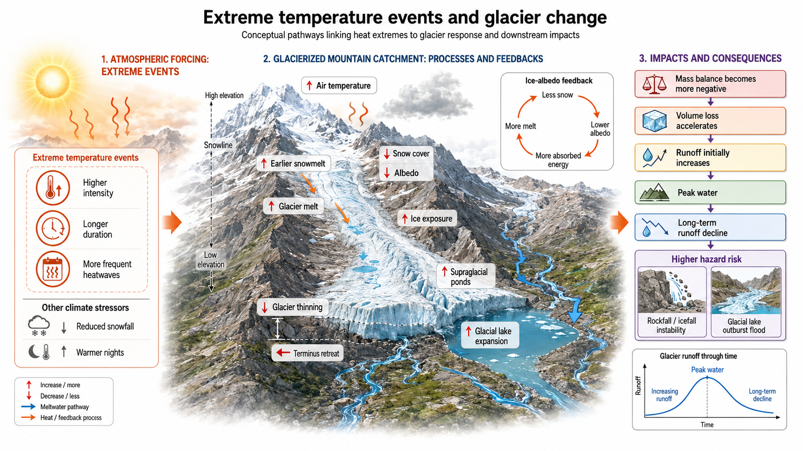

### Hi👏👏👏👏
my research focus on the climate and cryosphere change, extreme climate events and diaster induced by the cryosphere change.

rencently, i am working:

_glacier model: using the AI method to accumulate the calculative effective of ice-flow dynmicals, and construct the novel distuibuted enery-mass balance model.
_extreme temperature events: the extreme temperature changes by elevation and quantify the effective for glacier change.

my study area is High Moutain Asia (HMA), as the following picture

